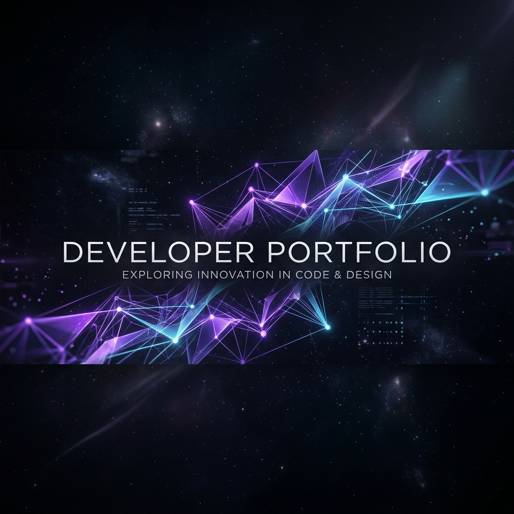

<p align="center">
  
</p>

<h1 align="center">Premium Developer Portfolio</h1>

<p align="center">
  
  
  
  
</p>

---

**Premium Developer Portfolio**, kişisel markanızı ve teknik yetkinliklerinizi en üst seviyede sergilemek için tasarlandı. Bu portfolio sadece bir web sitesi değil, GitHub ile tam entegre çalışan dinamik bir mühendislik vitrinidir.

## ✨ Öne Çıkan Özellikler

- **🔄 Dinamik GitHub Senkronizasyonu:** Projeler GitHub API üzerinden gerçek zamanlı olarak çekilir.
- **💎 Premium Estetik:** Glassmorphism, yumuşak geçişler ve modern karanlık mod tasarımı.
- **⚡ Yüksek Performans:** Vite ve React 19 tabanlı, optimize edilmiş render süreçleri.
- **📱 Kusursuz Mobil Deneyim:** Her ekran boyutu için tam duyarlı (responsive) mimari.
- **🎨 Tailwind 4 UI:** En yeni CSS standartları ile inşa edilmiş özel bileşenler.

## 🚀 Teknik Stack

- **Framework:** [React 19](https://react.dev/)
- **Bundler:** [Vite 6](https://vitejs.dev/)
- **Styling:** [Tailwind CSS 4](https://tailwindcss.com/)
- **Animation:** [Framer Motion](https://www.framer.com/motion/)
- **Icons:** [Lucide React](https://lucide.dev/)

## 🛠️ Yerel Çalıştırma

1. Projeyi klonlayın:
   ```bash
   git clone https://github.com/Emretetik0/portfolio.git
   ```
2. Bağımlılıkları yükleyin:
   ```bash
   npm install
   ```
3. Geliştirme sunucusunu başlatın:
   ```bash
   npm run dev
   ```

## 🌐 Canlı Önizleme

*Portfolyo şu an GitHub Pages üzerinde yayındadır.*

---

<p align="center">
  Developed with ❤️ by <a href="https://github.com/Emretetik0">Emretetik0</a>
</p>
